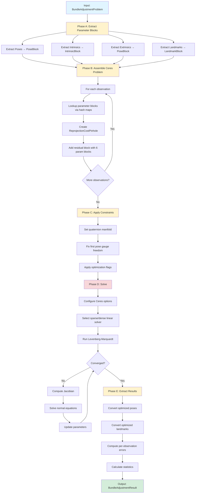
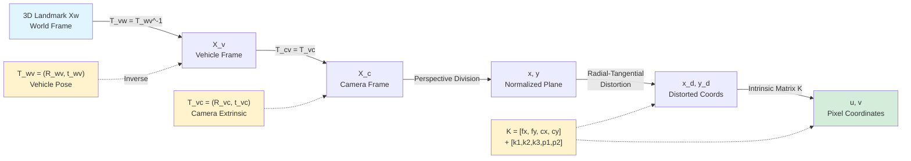
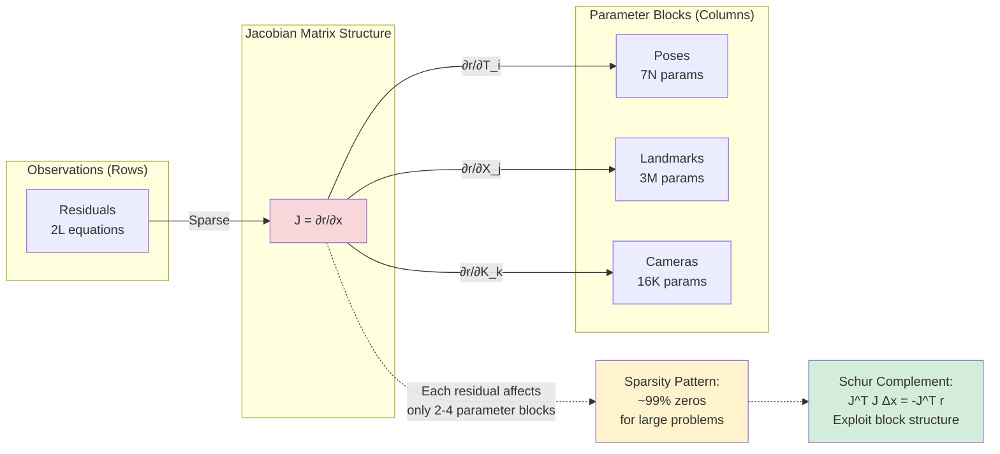

# Bundle Adjuster: Detailed Technical Explanation

## Table of Contents
1. [Overview](#overview)
2. [Mathematical Foundations](#mathematical-foundations)
3. [Code Architecture](#code-architecture)
4. [Coordinate Frame Transformations](#coordinate-frame-transformations)
5. [Camera Model & Distortion](#camera-model--distortion)
6. [Optimization Problem Formulation](#optimization-problem-formulation)
7. [Algorithm Flow](#algorithm-flow)
8. [Implementation Details](#implementation-details)

---

## Overview

The **Bundle Adjuster** is a non-linear least-squares optimizer that refines:
- **Vehicle poses** (position and orientation over time)
- **3D landmarks** (world coordinates of scene points)
- **Camera intrinsics** (focal length, principal point, distortion)
- **Camera extrinsics** (camera-to-vehicle transformation)

by minimizing the **reprojection error** between observed 2D keypoints and their predicted 2D projections.

### Problem Statement

Given:
- $N$ vehicle poses at timestamps $\{t_1, \ldots, t_N\}$
- $M$ 3D landmarks $\{\mathbf{X}_1, \ldots, \mathbf{X}_M\}$ in world coordinates
- $K$ cameras with intrinsic and extrinsic parameters
- $L$ observations (pixel measurements) linking poses, cameras, and landmarks

**Objective**: Minimize the total reprojection error across all observations.

---

## Mathematical Foundations

### 1. Coordinate Frames

The system uses three primary coordinate frames:

| Frame | Symbol | Description |
|-------|--------|-------------|
| **World** | $W$ | Fixed global reference frame |
| **Vehicle** | $V$ | Body frame of the moving platform |
| **Camera** | $C$ | Individual camera frame |

### 2. Transformation Chain

For a 3D point $\mathbf{X}_w$ in world coordinates to be projected to pixel $(u, v)$:

```
World → Vehicle → Camera → Normalized Image Plane → Distorted → Pixel
```

#### Mathematical Formulation:

**Step 1: World to Vehicle**
$$
\mathbf{X}_v = \mathbf{R}_{wv}^{-1} (\mathbf{X}_w - \mathbf{t}_{wv})
$$

Where:
- $\mathbf{R}_{wv}$ is the rotation matrix (from vehicle to world)
- $\mathbf{t}_{wv}$ is the translation vector (vehicle-to-world)
- Using quaternion $\mathbf{q}_{wv} = [q_x, q_y, q_z, q_w]$: $\mathbf{R}_{wv} = \text{Rot}(\mathbf{q}_{wv})$

**Step 2: Vehicle to Camera**
$$
\mathbf{X}_c = \mathbf{R}_{vc} \mathbf{X}_v + \mathbf{t}_{vc}
$$

Where:
- $\mathbf{R}_{vc}$ is the vehicle-to-camera rotation (extrinsic calibration)
- $\mathbf{t}_{vc}$ is the vehicle-to-camera translation

**Step 3: Perspective Division**
$$
\begin{bmatrix} x \\ y \end{bmatrix} = \begin{bmatrix} X_c / Z_c \\ Y_c / Z_c \end{bmatrix}
$$

**Step 4: Radial-Tangential Distortion**

Radial distortion:
$$
r^2 = x^2 + y^2
$$
$$
\text{radial} = 1 + k_1 r^2 + k_2 r^4 + k_3 r^6
$$

Tangential distortion:
$$
\begin{aligned}
x_t &= 2p_1 xy + p_2(r^2 + 2x^2) \\
y_t &= p_1(r^2 + 2y^2) + 2p_2 xy
\end{aligned}
$$

Distorted coordinates:
$$
\begin{aligned}
x_d &= x \cdot \text{radial} + x_t \\
y_d &= y \cdot \text{radial} + y_t
\end{aligned}
$$

**Step 5: Intrinsic Projection**
$$
\begin{bmatrix} u \\ v \end{bmatrix} = \begin{bmatrix} f_x \cdot x_d + c_x \\ f_y \cdot y_d + c_y \end{bmatrix}
$$

Where:
- $(f_x, f_y)$ are focal lengths in pixels
- $(c_x, c_y)$ is the principal point
- $(k_1, k_2, k_3)$ are radial distortion coefficients
- $(p_1, p_2)$ are tangential distortion coefficients

---

## Code Architecture

### Phase Structure

The `BundleAdjuster::solve()` method follows a 5-phase pipeline:

```
A. Extract Parameter Blocks
    ↓
B. Assemble Ceres Problem
    ↓
C. Apply Constraints
    ↓
D. Solve Optimization
    ↓
E. Extract Results
```

**Visual Overview:**



### Parameter Blocks

The optimizer parameterizes the problem using contiguous memory blocks:

#### 1. **PoseBlock** (7 parameters per pose)
```cpp
struct PoseBlock {
    double q[4];  // Quaternion [x, y, z, w] (Eigen internal order)
    double t[3];  // Translation [tx, ty, tz]
};
```

**Mathematical representation:**
$$
\mathbf{T}_{wv} = \begin{bmatrix} \mathbf{R}_{wv} & \mathbf{t}_{wv} \\ \mathbf{0}^T & 1 \end{bmatrix} \in SE(3)
$$

#### 2. **IntrinsicBlock** (9 parameters per camera)
```cpp
struct IntrinsicBlock {
    double params[9];  // [fx, fy, cx, cy, k1, k2, p1, p2, k3]
};
```

#### 3. **LandmarkBlock** (3 parameters per landmark)
```cpp
struct LandmarkBlock {
    double xyz[3];  // World coordinates [X, Y, Z]
};
```

---

## Coordinate Frame Transformations

### Transformation Pipeline



### Quaternion Conventions

**Storage Order (Eigen internal):** $[x, y, z, w]$

**Constructor Order:** `Quaterniond(w, x, y, z)`

**Conjugate (Inverse for unit quaternions):**
$$
\mathbf{q}^* = [-x, -y, -z, w]
$$

Used to invert rotations:
$$
\mathbf{R}_{vw} = \mathbf{R}_{wv}^{-1} \Rightarrow \mathbf{q}_{vw} = \mathbf{q}_{wv}^*
$$

### Transformation Composition

For transforming world point $\mathbf{X}_w$ to camera coordinates $\mathbf{X}_c$:

$$
\mathbf{X}_c = \mathbf{T}_{cv} \mathbf{T}_{vw} \mathbf{X}_w
$$

Where:
- $\mathbf{T}_{vw} = \mathbf{T}_{wv}^{-1}$ (world-to-vehicle)
- $\mathbf{T}_{cv} = \mathbf{T}_{vc}$ (given as extrinsic)

**Expanded form:**
$$
\mathbf{X}_c = \mathbf{R}_{vc} \left[ \mathbf{R}_{wv}^{-1} (\mathbf{X}_w - \mathbf{t}_{wv}) \right] + \mathbf{t}_{vc}
$$

This is exactly what the code implements:
```cpp
Eigen::Vector3d X_vehicle = q_wv.conjugate() * (Xw - t_wv);
Eigen::Vector3d X_camera = q_vc * X_vehicle + t_vc;
```

---

## Camera Model & Distortion

### Pinhole Camera Model

The ideal pinhole projection is:
$$
\pi: \mathbb{R}^3 \rightarrow \mathbb{R}^2
$$
$$
\pi(\mathbf{X}_c) = \begin{bmatrix} f_x & 0 & c_x \\ 0 & f_y & c_y \end{bmatrix} \begin{bmatrix} X_c/Z_c \\ Y_c/Z_c \\ 1 \end{bmatrix}
$$

### Brown-Conrady Distortion Model

The full distortion model accounts for:

1. **Radial distortion** (caused by lens curvature):
   $Problem Structure

```mermaid
graph TD
    subgraph "Parameter Blocks"
        P1[Pose 1<br/>q_wv, t_wv]
        P2[Pose 2<br/>q_wv, t_wv]
        P3[Pose 3<br/>q_wv, t_wv]
        PN[Pose N<br/>q_wv, t_wv]
        
        L1[Landmark 1<br/>X, Y, Z]
        L2[Landmark 2<br/>X, Y, Z]
        LM[Landmark M<br/>X, Y, Z]
        
        CAM[Camera<br/>Intrinsics + Extrinsics]
    end
    
    subgraph "Residual Blocks"
        R1[Obs 1: r = u_obs - π(...)]
        R2[Obs 2: r = u_obs - π(...)]
        R3[Obs 3: r = u_obs - π(...)]
        RK[Obs K: r = u_obs - π(...)]
    end
    
    P1 --> R1
    L1 --> R1
    CAM --> R1
    
    P1 --> R2
    L2 --> R2
    CAM --> R2
    
    P2 --> R3
    L1 --> R3
    CAM --> R3
    
    P3 --> RK
    LM --> RK
    CAM --> RK
    
    R1 -.->|Minimize| COST[Total Cost<br/>Σ ρ||r||²]
    R2 -.-> COST
    R3 -.-> COST
    RK -.-> COST
    
    style COST fill:#f8d7da
    style P1 fill:#e1f5ff
    style P2 fill:#e1f5ff
    style P3 fill:#e1f5ff
    style PN fill:#e1f5ff
    style L1 fill:#d4edda
    style L2 fill:#d4edda
    style LM fill:#d4edda
    style CAM fill:#fff3cd
```

### $
   \Delta r = k_1 r^2 + k_2 r^4 + k_3 r^6
   $$

2. **Tangential distortion** (caused by lens misalignment):
   $$
   \begin{aligned}
   \Delta x_t &= 2p_1 xy + p_2(r^2 + 2x^2) \\
   \Delta y_t &= p_1(r^2 + 2y^2) + 2p_2 xy
   \end{aligned}
   $$

### Physical Interpretation

- **$k_1, k_2, k_3 < 0$**: Barrel distortion (fish-eye effect)
- **$k_1, k_2, k_3 > 0$**: Pincushion distortion
- **$p_1, p_2$**: Decentering distortion (asymmetric)

---

## Optimization Problem Formulation

### Objective Function

The bundle adjustment problem minimizes the sum of squared reprojection errors:

$$
\min_{\{\mathbf{T}_i\}, \{\mathbf{X}_j\}, \mathbf{K}, \mathbf{T}_{vc}} \sum_{i,j,k} \rho\left( \| \mathbf{u}_{ijk}^{obs} - \pi(\mathbf{T}_i, \mathbf{T}_{vc}, \mathbf{K}, \mathbf{X}_j) \|^2 \right)
$$

Where:
- $i$ indexes vehicle poses (timestamps)
- $j$ indexes 3D landmarks
- $k$ indexes cameras
- $\mathbf{u}_{ijk}^{obs}$ is the observed pixel coordinate
- $\pi(\cdot)$ is the full projection function (including distortion)
- $\rho(\cdot)$ is a robust loss function (e.g., Huber)

### Residual Definition

For each observation, the residual vector is:
$$
\mathbf{r}_{ijk} = \begin{bmatrix} u_{obs} - \hat{u} \\ v_{obs} - \hat{v} \end{bmatrix} \in \mathbb{R}^2
$$

Where $(\hat{u}, \hat{v}) = \pi(\mathbf{T}_i, \mathbf{T}_{vc}, \mathbf{K}, \mathbf{X}_j)$

### Robust Loss Function

To handle outliers, the code uses **Huber Loss**:

$$
\rho(r) = \begin{cases}
\frac{1}{2} r^2 & \text{if } |r| \leq \delta \\
\delta (|r| - \frac{1}{2}\delta) & \text{otherwise}
\end{cases}
$$

This is quadratic near zero (like standard least squares) but linear for large errors (reducing outlier influence).

### Parameter Space

The optimization operates in:
- **Poses**: $N \times 7$ parameters (quaternion + translation)
- **Landmarks**: $M \times 3$ parameters (XYZ world coordinates)
- **Intrinsics**: $K \times 9$ parameters per camera
- **Extrinsics**: $K \times 7$ parameters per camera

**Total DOF**: $7N + 3M + 9K + 7K$

### Manifold Constraints

Quaternions lie on the unit sphere $S^3 \subset \mathbb{R}^4$:
$$
\|\mathbf{q}\|^2 = q_x^2 + q_y^2 + q_z^2 + q_w^2 = 1
$$

Ceres uses a **local parameterization** (manifold) to respect this constraint during optimization, ensuring quaternions remain normalized.

---

## Algorithm Flow

### Phase A: Extract Parameter Blocks

```cpp
std::vector<PoseBlock> pose_blocks;
std::vector<IntrinsicBlock> intr_blocks;
std::vector<PoseBlock> extr_blocks;
std::vector<LandmarkBlock> lm_blocks;
```

**Purpose:** Convert from contract types to contiguous double arrays suitable for Ceres.

**Index Mapping:** Create hash maps for $O(1)$ lookup:
- `pose_index[timestamp_ns] → pose block index`
- `cam_index[camera_id] → intrinsic block index`
- `extr_index[camera_id] → extrinsic block index`
- `lm_index[landmark_id] → landmark block index`

### Phase B: Assemble Ceres Problem

For each observation $(u, v)$ at timestamp $t$, camera $k$, landmark $j$:

1. **Lookup parameter blocks** using index maps
2. **Create cost function** using `ReprojectionCostPinhole::Create()`
3. **Add residual block** linking 6 parameter blocks:
   ```cpp
   ceres_problem.AddResidualBlock(
       cost,              // 2D residual
       loss,              // Huber loss
       pose.q, pose.t,    // 4+3 params
       extr.q, extr.t,    // 4+3 params
       intr.params,       // 9 params
       lm.xyz             // 3 params
   );
   ```

**Result:** Sparse graph structure where each observation creates edges between parameter blocks.

### Phase C: Apply Constraints

#### 1. Quaternion Manifold
```cpp
auto* q_manifold = new ceres::EigenQuaternionManifold();
ceres_problem.SetManifold(pose.q, q_manifold);
```
Ensures quaternions stay normalized during optimization.

#### 2. Gauge Freedom Fix
```cpp
ceres_problem.SetParameterBlockConstant(pose_blocks[0].q);
ceres_problem.SetParameterBlockConstant(pose_blocks[0].t);
```

**Why needed?** Bundle adjustment has 7 DOF gauge freedom:
- 3 DOF translation (arbitrary world origin)
- 3 DOF rotation (arbitrary world orientation)
- 1 DOF scale (if intrinsics unknown)

Fixing the first pose removes translation/rotation ambiguity.

#### 3. Selective Optimization Flags
- `optimize_intrinsics = false` → Lock focal length, distortion
- `optimize_extrinsics = false` → Lock camera-to-vehicle transform
- `optimize_poses = false` → Lock all vehicle poses
- `optimize_landmarks = false` → Lock landmark positions

### Phase D: Solve

#### Solver Configuration
```cpp
options.linear_solver_type = ceres::SPARSE_NORMAL_CHOLESKY;
options.max_num_iterations = params.max_iterations;
options.num_threads = 8;
```

#### Linear Solver Selection

Bundle adjustment produces a **sparse Jacobian**:
$$
\mathbf{J} = \begin{bmatrix}
\frac{\partial \mathbf{r}_1}{\partial 

### Reprojection Cost Function Flow

```mermaid
flowchart TB
    subgraph "Input Parameters (6 blocks)"
        IN1[q_wv: Vehicle Pose Rotation]
        IN2[t_wv: Vehicle Pose Translation]
        IN3[q_vc: Camera Extrinsic Rotation]
        IN4[t_vc: Camera Extrinsic Translation]
        IN5[intr: 9 intrinsic params<br/>fx,fy,cx,cy,k1,k2,p1,p2,k3]
        IN6[Xw: 3D Landmark World Coords]
    end
    
    IN1 --> T1
    IN2 --> T1
    IN6 --> T1[Transform: World → Vehicle<br/>X_v = R_wv^-1 * Xw - t_wv]
    
    T1 --> T2
    IN3 --> T2
    IN4 --> T2[Transform: Vehicle → Camera<br/>X_c = R_vc * X_v + t_vc]
    
    T2 --> C1{Z_c > 0.1?}
    C1 -->|No| BEHIND[Large penalty<br/>r = [10000, 10000]]
    C1 -->|Yes| T3[Perspective Division<br/>x = X_c/Z_c, y = Y_c/Z_c]
    
    T3 --> D1[Compute r² = x² + y²]
    D1 --> D2[Radial distortion<br/>radial = 1 + k₁r² + k₂r⁴ + k₃r⁶]
    D2 --> D3[Tangential distortion<br/>x_t, y_t from p₁, p₂]
    D3 --> D4[Apply distortion<br/>x_d = x·radial + x_t<br/>y_d = y·radial + y_t]
    
    D4 --> P1
    IN5 --> P1[Project to pixels<br/>u_hat = fx·x_d + cx<br/>v_hat = fy·y_d + cy]
    
    P1 --> R1[Compute residual<br/>residual[0] = u_obs - u_hat<br/>residual[1] = v_obs - v_hat]
    BEHIND --> R1
    
    R1 --> OUT[Output: 2D residual vector]
    
    style IN1 fill:#e1f5ff
    style IN2 fill:#e1f5ff
    style IN3 fill:#fff3cd
    style IN4 fill:#fff3cd
    style IN5 fill:#fff3cd
    style IN6 fill:#d4edda
    style OUT fill:#f8d7da
    style BEHIND fill:#ffe0e0
```\mathbf{T}_1} & \cdots & \frac{\partial \mathbf{r}_1}{\partial \mathbf{X}_m} \\
\vdots & \ddots & \vdots \\
\frac{\partial \mathbf{r}_n}{\partial \mathbf{T}_1} & \cdots & \frac{\partial \mathbf{r}_n}{\partial \mathbf{X}_m}
\end{bmatrix}
$$

Each row (observation) has **only 4 non-zero blocks** corresponding to its:
- Vehicle pose
- Camera extrinsic
- Camera intrinsic
- 3D landmark

**Schur complement** exploits this structure for efficient solving.

#### Gauss-Newton Iteration

At each iteration:
1. **Linearize** the residuals around current parameters
2. **Form normal equations**: $\mathbf{J}^T \mathbf{J} \Delta \mathbf{x} = -\mathbf{J}^T \mathbf{r}$
3. **Solve for update** $\Delta \mathbf{x}$ using sparse Cholesky
4. **Update parameters**: $\mathbf{x} \leftarrow \mathbf{x} + \Delta \mathbf{x}$
5. **Check convergence** (gradient norm, cost change, parameter change)

### Phase E: Extract Results

#### 1. Convert Optimized Parameters Back
```cpp
result.optimized_poses.poses_buffer[i].pose = 
    qt_To_PoseSE3(pose_blocks[i].q, pose_blocks[i].t);
```

#### 2. Compute Per-Observation Errors
```cpp
Eigen::Vector2d uv_pred = projectPinholeRadTan(X_camera, K);
float err = sqrt((u_obs - uv_pred.x())² + (v_obs - uv_pred.y())²);
```

#### 3. Statistics
- **Mean reprojection error**: $\bar{e} = \frac{1}{L} \sum_{i=1}^{L} \|\mathbf{r}_i\|$
- **Max error**: $e_{max} = \max_i \|\mathbf{r}_i\|$
- **Inlier count**: Number of observations with $\|\mathbf{r}_i\| \leq \delta_{max}$



---

## Implementation Details

### Automatic Differentiation

The cost function uses **Ceres AutoDiff**:
```cpp
ceres::AutoDiffCostFunction<ReprojectionCostPinhole, 2, 4, 3, 4, 3, 9, 3>
```

**Advantages:**
- Exact derivatives (no numerical approximation)
- Efficient computation via dual numbers
- Type-safe templating for Jet scalars

### Behind-Camera Guard
```cpp
if (X_camera.z() <= T(1e-6)) {
    residuals[0] = T(1e4);  // Large penalty
    residuals[1] = T(1e4);
    return true;
}
```

Prevents singularities when landmarks are behind the camera (undefined projection).

### Sparse Matrix Structure

Example for 3 poses, 4 landmarks, and 8 observations:

```
        | T₁ | T₂ | T₃ | X₁ | X₂ | X₃ | X₄ |
    ────┼────┼────┼────┼────┼────┼────┼────┤
    r₁  | ●  |    |    | ●  |    |    |    |  (pose 1, lm 1)
    r₂  | ●  |    |    |    | ●  |    |    |  (pose 1, lm 2)
    r₃  |    | ●  |    | ●  |    |    |    |  (pose 2, lm 1)
    r₄  |    | ●  |    |    |    | ●  |    |  (pose 2, lm 3)
    r₅  |    |    | ●  |    | ●  |    |    |  (pose 3, lm 2)
    r₆  |    |    | ●  |    |    | ●  |    |  (pose 3, lm 3)
    r₇  | ●  |    |    |    |    |    | ●  |  (pose 1, lm 4)
    r₈  |    | ●  |    |    |    |    | ●  |  (pose 2, lm 4)
```

**Key property:** Each residual depends on exactly **one pose** and **one landmark** (plus shared camera parameters).

This sparsity enables efficient solving via **Schur complement** or **block-wise methods**.

---

## Convergence Analysis

### Termination Criteria

Ceres stops when any of these conditions are met:

1. **Gradient convergence**: $\|\nabla f\| < \epsilon_g$ (default: $10^{-10}$)
2. **Function convergence**: $|\Delta f| / f < \epsilon_f$ (default: $10^{-8}$)
3. **Parameter convergence**: $\|\Delta \mathbf{x}\| < \epsilon_x$ (default: $10^{-8}$)
4. **Maximum iterations**: Reached `max_iterations`

### Cost Evolution

Typical convergence behavior:
```
Iteration  Cost         |gradient|    |step|
    0      125843.2     8.43e+03      0.00e+00
    1      15249.7      2.14e+03      1.82e+01
    2      8423.1       5.87e+02      8.91e+00
    3      5891.4       1.23e+02      4.13e+00
    ...
   15      4782.3       3.21e-09      2.14e-08   ← CONVERGENCE
```

### Quality Metrics

**Good result indicators:**
- Final cost < 5000 (for ~1000 observations)
- Mean reprojection error < 0.5 pixels
- 95th percentile error < 1.0 pixels
- Inlier ratio > 95%
- Iterations < 50

---

## Debugging Checklist

### Common Issues

| Problem | Symptom | Solution |
|---------|---------|----------|
| **No convergence** | Cost stuck or increasing | Check gauge fix on first pose |
| **High final error** | Mean error > 2 pixels | Verify distortion coefficients |
| **Negative depth** | Behind-camera penalties | Fix pose initialization |
| **Quaternion errors** | Runtime assertion failures | Ensure manifold is set |
| **Sparse solver unavailable** | Falls back to DENSE_QR | Install SuiteSparse or enable Eigen sparse |

### Validation Strategy

1. **Synthetic test**: Run on generated data with known ground truth
2. **Residual analysis**: Check for biased errors (systematic calibration issues)
3. **Per-frame breakdown**: Identify problematic frames
4. **Landmark depth distribution**: Ensure reasonable Z values (5-100m)

---

## Performance Characteristics

### Computational Complexity

- **Per-observation cost evaluation**: $O(1)$
- **Jacobian computation (AutoDiff)**: $O(1)$ per observation
- **Sparse linear solve**: $O((N+M)^{1.5})$ with Schur complement
- **Total iteration cost**: $O(L + (N+M)^{1.5})$ where $L$ = observations

### Memory Usage

- **Parameter blocks**: $(7N + 3M + 16K) \times 8$ bytes (doubles)
- **Jacobian storage**: $L \times 28 \times 8$ bytes (sparse)
- **Solver workspace**: $O((N+M)^2)$ for normal equations

### Typical Performance

On a modern CPU (8 threads):
- **500 observations, 15 poses, 100 landmarks**: ~50 ms/iteration, 10-20 iterations = **0.5-1.0 seconds**
- **5000 observations, 100 poses, 1000 landmarks**: ~300 ms/iteration, 20-30 iterations = **6-9 seconds**

---

## Theoretical Background

### Why "Bundle" Adjustment?

The term "bundle" refers to the bundle of light rays emanating from each 3D point to multiple camera positions. The algorithm adjusts both:
- The **3D points** (where rays converge)
- The **camera poses** (ray origins)

simultaneously to minimize the geometric error.

### Connection to SLAM

Bundle adjustment is the **backend optimization** in:
- **Visual SLAM** (Simultaneous Localization and Mapping)
- **Structure from Motion** (SfM)
- **Multi-view 3D reconstruction**

It refines the initial estimates from:
- **Frontend tracking** (feature matching, motion estimation)
- **Loop closure detection** (global consistency)

### Related Algorithms

- **Pose Graph Optimization**: Only optimizes poses (no landmarks)
- **Levenberg-Marquardt**: General non-linear least squares (Ceres uses this internally)
- **RANSAC**: Outlier rejection (often used before BA)
- **Incremental BA**: Add poses/landmarks one at a time (iSAM2, DSO)

---

## References

### Key Papers

1. **Triggs et al. (2000)**: "Bundle Adjustment — A Modern Synthesis"
2. **Hartley & Zisserman (2004)**: "Multiple View Geometry in Computer Vision"
3. **Brown (1971)**: "Close-range camera calibration" (distortion model)
4. **Agarwal et al. (2010)**: "Building Rome in a Day" (large-scale BA)

### Software Libraries

- **Ceres Solver**: http://ceres-solver.org/
- **g2o**: https://github.com/RainerKuemmerle/g2o
- **GTSAM**: https://gtsam.org/

---

## Summary

The `BundleAdjuster::solve()` implementation:

1. ✅ **Converts** input data to Ceres-compatible parameter blocks
2. ✅ **Constructs** a sparse optimization problem with reprojection error costs
3. ✅ **Applies** manifold constraints (quaternion normalization)
4. ✅ **Fixes** gauge freedom (first pose constant)
5. ✅ **Solves** using Levenberg-Marquardt with sparse Cholesky
6. ✅ **Extracts** optimized poses, landmarks, and error statistics

**Output:** Refined 3D map and vehicle trajectory with sub-pixel reprojection accuracy.

---

*This document provides a complete mathematical and implementation-level explanation of the bundle adjustment solver. For practical usage, refer to the Python visualization tools in `calibri/tools/`.*
