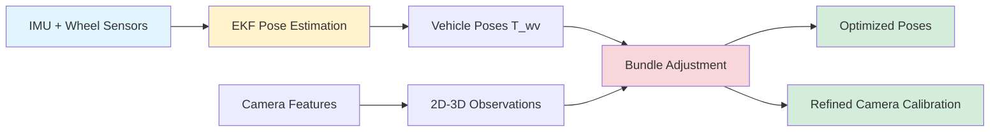

# Theoretical Background: Vehicle Pose Estimation & Camera Calibration
**Integration with Bundle Adjustment Calibration System**

---

## Table of Contents

1. [Overview & Integration Context](#overview--integration-context)
2. [Problem Definition](#problem-definition)
3. [Sensor Systems & Measurement Models](#sensor-systems--measurement-models)
4. [State-Space Formulation](#state-space-formulation)
5. [Phase-Gated Modeling Approach](#phase-gated-modeling-approach)
6. [Continuous-Time Motion Model](#continuous-time-motion-model)
7. [Extended Kalman Filter (EKF)](#extended-kalman-filter-ekf)
8. [Measurement Fusion](#measurement-fusion)
9. [Covariance Propagation & Uncertainty](#covariance-propagation--uncertainty)
10. [Error Sources & Mitigation](#error-sources--mitigation)
11. [Integration with Bundle Adjustment](#integration-with-bundle-adjustment)
12. [Parameter Tuning & Optimization](#parameter-tuning--optimization)
13. [Theoretical Summary](#theoretical-summary)
14. [References](#references)

---

## Overview & Integration Context

This document establishes the theoretical foundation for **vehicle pose estimation** in the context of a **camera calibration system**. While the bundle adjustment (BA) engine (documented in `ARCHITECTURE.md`) refines camera parameters from visual observations, the pose estimation system provides:

1. **Vehicle trajectory** as input to bundle adjustment
2. **Initial pose estimates** for optimization
3. **Odometry constraints** (future Iteration 3) as pose-to-pose edges
4. **Ground truth** for validation in controlled testing

### System Architecture Integration

```
┌─────────────────────────────────────────────────────────────────┐
│                    Thesis System Architecture                    │
├─────────────────────────────────────────────────────────────────┤
│                                                                  │
│  Sensor Layer           Estimation Layer        Calibration     │
│  ┌──────────┐           ┌──────────────┐       ┌──────────┐    │
│  │   IMU    │           │              │       │          │    │
│  │ ax,ay,az │──────────→│     EKF      │       │  Bundle  │    │
│  │ gx,gy,gz │           │   Pose Est.  │──────→│  Adjust. │    │
│  └──────────┘           │              │ T_wv  │          │    │
│                         │  (px,py,ψ,   │       │ Refines: │    │
│  ┌──────────┐           │   vx,vy,r)   │       │ - Intr.  │    │
│  │  Wheel   │           │              │       │ - Extr.  │    │
│  │  Speed   │──────────→│  15-state    │       │ - Poses  │    │
│  │ ωRL,ωRR  │           │  model       │       │ - 3D pts │    │
│  └──────────┘           └──────────────┘       └──────────┘    │
│                                │                      ↑         │
│  ┌──────────┐                 │                      │         │
│  │ Camera   │─────────────────┴──────────────────────┘         │
│  │ Features │    (2D-3D observations)                          │
│  └──────────┘                                                   │
│                                                                  │
│  Legend:                                                        │
│  - EKF provides vehicle poses T_wv (world-to-vehicle)           │
│  - Bundle Adjustment refines poses + camera calibration         │
│  - Camera features provide 2D-3D correspondences                │
└─────────────────────────────────────────────────────────────────┘
```

### Why Both Systems Are Needed

| System | Purpose | Inputs | Outputs |
|--------|---------|--------|---------|
| **EKF Pose Estimation** | Real-time ego-motion tracking | IMU + wheel speeds | Vehicle poses (px, py, ψ, vx, vy, r) |
| **Bundle Adjustment** | Offline calibration refinement | 3D landmarks + 2D observations + poses | Optimized camera params + refined poses |

**Key Insight:** EKF provides the **initial trajectory estimate**, which BA then **refines jointly with calibration parameters** using visual reprojection error minimization.

---

## Problem Definition

### 1.1 Pose Estimation Objective

The central objective is to compute the **ego-vehicle's 2D motion state** over time:

- **Global position:** $(p_x, p_y)$ in world frame
- **Heading (yaw):** $\psi$ (orientation angle)
- **Linear velocities:** $v_x$ (longitudinal), $v_y$ (lateral)
- **Rotational velocity (yaw rate):** $r$ (angular velocity about z-axis)

**Challenge:** Each sensor source alone is insufficient:

| Sensor | Limitation |
|--------|------------|
| **IMU only** | Integration drift → errors grow quadratically ($\sim \frac{1}{2} b_a t^2$) |
| **Wheel speeds only** | Cannot infer heading; suffers from wheel slip |

**Solution:** Extended Kalman Filter (EKF) sensor fusion.

### 1.2 Bundle Adjustment Objective

Given vehicle poses from EKF, BA minimizes:

$$
\min_{\{\mathbf{T}_i\}, \{\mathbf{X}_j\}, \mathbf{K}} \sum_{i,j,k} \rho\left( \| \mathbf{u}_{ijk}^{obs} - \pi(\mathbf{T}_i, \mathbf{T}_{vc}, \mathbf{K}, \mathbf{X}_j) \|^2 \right)
$$

Where:
- $\mathbf{T}_i$ = vehicle pose at frame $i$ (initialized from EKF)
- $\mathbf{X}_j$ = 3D landmark position
- $\mathbf{K}$ = camera intrinsics
- $\pi(\cdot)$ = projection function (Pinhole + distortion)

**Key Connection:** EKF poses serve as **initialization** for $\mathbf{T}_i$ in bundle adjustment.

---

## Sensor Systems & Measurement Models

### 2.1 Inertial Measurement Unit (IMU)

The IMU measures:

**Linear acceleration:**
$$
a_x^{meas} = a_x^{true} + b_{ax} + n_{ax}
$$
$$
a_y^{meas} = a_y^{true} + b_{ay} + n_{ay}
$$

**Angular velocity:**
$$
g_z^{meas} = r^{true} + b_{gz} + n_{gz}
$$

Where:
- $b$ = **bias** (slow-varying offset, modeled as random walk)
- $n$ = **white noise** (zero-mean Gaussian)
- $a_x, a_y$ = body-frame accelerations
- $g_z$ = yaw-rate (rotation about z-axis)

#### Why IMU Cannot Be Used Alone

Acceleration must be **double-integrated** to get position:

$$
v(t) = v_0 + \int_0^t (a^{meas} - b_a) \, d\tau
$$
$$
p(t) = p_0 + \int_0^t v(\tau) \, d\tau \approx p_0 + v_0 t + \frac{1}{2} b_a t^2
$$

Even a **0.5% bias** produces **meters of drift** within seconds.

**Example:**
- Bias: $b_a = 0.05 \, \text{m/s}^2$
- Time: $t = 10 \, \text{s}$
- Drift: $p(10) \approx \frac{1}{2} \times 0.05 \times 10^2 = 2.5 \, \text{m}$

### 2.2 Wheel Speed Encoders

For each wheel:
$$
v_{wheel} = \omega \cdot R
$$

Where:
- $\omega$ = angular velocity (rad/s)
- $R$ = wheel radius (m)

**Advantages:**
- ✅ Robust in forward motion
- ✅ Does **not** integrate drift
- ✅ Provides **direct speed constraints**

#### Differential Wheel Model

For a rear-wheel pair (track width $T$):

$$
v_{RL} = v_x - r \frac{T}{2}
$$
$$
v_{RR} = v_x + r \frac{T}{2}
$$

Solving for longitudinal speed and yaw rate:

$$
v_x = \frac{v_{RL} + v_{RR}}{2}
$$
$$
r = \frac{v_{RR} - v_{RL}}{T}
$$

**This is the fundamental geometric model** behind wheel-based yaw estimation.

#### Limitations: Wheel Slip

At high yaw rate or low $v_x$:
$$
v_{wheel} \neq v_x \pm r \frac{T}{2}
$$

Slip causes:
- ❌ Incorrect speed updates
- ❌ Incorrect yaw-rate estimation
- ❌ **Path folding** and inward spiral (observed as "petal" plots)

**Solution:** Model wheel slip explicitly in state vector (Phase 2).

### 2.3 Camera (Visual Odometry)

While not used in the EKF directly, camera observations provide:

**2D-3D correspondences:**
$$
\mathbf{u}_{ijk} = (u, v) \quad \leftrightarrow \quad \mathbf{X}_j = (X, Y, Z)
$$

**Reprojection constraint:**
$$
\mathbf{u}^{obs} = \pi(\mathbf{T}_{wv}, \mathbf{T}_{vc}, \mathbf{K}, \mathbf{X}_w)
$$

**Usage in BA:**
- Refine EKF pose estimates
- Calibrate camera intrinsics/extrinsics
- Recover 3D landmark positions

---

## State-Space Formulation

### 3.1 Full 15-State Vector

$$
\mathbf{x} =
\begin{bmatrix}
p_x & p_y & \psi & v_x & r & b_{ax} & b_{gz} & v_y & b_{ay} & \kappa_{RL} & \kappa_{RR} & s_R & s_F & \delta_{bias} & \theta
\end{bmatrix}^{T}
$$

| Index | State | Description | Units |
|-------|-------|-------------|-------|
| 1-2 | $p_x, p_y$ | Global position | m |
| 3 | $\psi$ | Heading (yaw) | rad |
| 4 | $v_x$ | Longitudinal velocity | m/s |
| 5 | $r$ | Yaw rate | rad/s |
| 6 | $b_{ax}$ | Longitudinal accel bias | m/s² |
| 7 | $b_{gz}$ | Gyro bias | rad/s |
| 8 | $v_y$ | Lateral velocity | m/s |
| 9 | $b_{ay}$ | Lateral accel bias | m/s² |
| 10-11 | $\kappa_{RL}, \kappa_{RR}$ | Wheel slip coefficients | - |
| 12-13 | $s_R, s_F$ | Scale factors (rear/front) | - |
| 14 | $\delta_{bias}$ | Steering angle bias | rad |
| 15 | $\theta$ | Pitch angle | rad |

**Note:** Only **7 states** are active in Phase 0 (baseline).

### 3.2 Coordinate Frame Conventions

**World Frame (W):**
- Fixed global reference
- Origin at start position
- X-axis: East, Y-axis: North, Z-axis: Up (ENU convention)

**Vehicle Frame (V):**
- Origin at vehicle center of mass
- X-axis: Forward, Y-axis: Left, Z-axis: Up
- Orientation defined by heading $\psi$

**Transformation:**
$$
\begin{bmatrix} p_x^W \\ p_y^W \end{bmatrix} =
\begin{bmatrix} \cos \psi & -\sin \psi \\ \sin \psi & \cos \psi \end{bmatrix}
\begin{bmatrix} v_x^V \\ v_y^V \end{bmatrix}
$$

**Connection to BA:**
- EKF outputs $\mathbf{T}_{wv}$ (world-to-vehicle)
- BA uses $\mathbf{T}_{wv}$ as pose parameter blocks (see `bundle_adjuster.cc:PoseBlock`)

---

## Phase-Gated Modeling Approach

To incrementally add model complexity **without compromising stability**, the EKF uses **phase gating**:

| Phase | Active States | Purpose |
|-------|---------------|---------|
| **0** | 1-7 | Baseline 2D odometry (px, py, ψ, vx, r, biases) |
| **1** | 1-9 | + Lateral dynamics (vy, bay) |
| **2** | 1-12 | + Wheel slip + scale factors (κRL, κRR, sR, sF) |
| **3** | 1-15 | + Steering geometry + pitch (δbias, θ) |

**Implementation:**
- Non-active states have **zero covariance** → updates do not affect them
- State activation controlled by configuration flags

**Benefits:**
- ✅ Backward compatibility (Phase 0 = standard bicycle model)
- ✅ Safe incremental model expansion
- ✅ Clean validation per phase

**Example (Phase 0 → Phase 1):**
```cpp
if (config.phase >= 1) {
    // Activate lateral velocity state
    P(7, 7) = config.initial_vy_variance;  // vy uncertainty
    P(8, 8) = config.initial_bay_variance; // ay bias uncertainty
}
```

---

## Continuous-Time Motion Model

### 5.1 Kinematic Equations

**Position:**
$$
\dot{p}_x = v_x \cos \psi - v_y \sin \psi
$$
$$
\dot{p}_y = v_x \sin \psi + v_y \cos \psi
$$

**Heading:**
$$
\dot{\psi} = r
$$

**Longitudinal Velocity:**
$$
\dot{v}_x = a_x - b_{ax} + v_y r
$$

**Lateral Velocity (Phase 1):**
$$
\dot{v}_y = a_y - b_{ay} - v_x r
$$

**Yaw Rate:**
$$
r = g_z - b_{gz}
$$

**Biases (Random Walk):**
$$
\dot{b}_{ax} = w_{ax}, \quad \dot{b}_{gz} = w_{gz}, \quad \dot{b}_{ay} = w_{ay}
$$

Where $w \sim \mathcal{N}(0, \sigma_w^2)$ is process noise.

### 5.2 Coriolis Forces

The term $v_y r$ in $\dot{v}_x$ represents **centrifugal coupling**:
- During a turn ($r \neq 0$), lateral velocity $v_y$ induces longitudinal acceleration
- This is a **nonlinear coupling** term

Similarly, $-v_x r$ in $\dot{v}_y$ is the **Coriolis acceleration**.

**Physical Interpretation:**
In a coordinated turn, the vehicle's body frame is rotating. Forces in the rotating frame include fictitious forces (centrifugal, Coriolis).

### 5.3 Nonlinear System Model

The full continuous-time model:
$$
\dot{\mathbf{x}} = \mathbf{f}(\mathbf{x}, \mathbf{u}, \mathbf{w})
$$

Where:
- $\mathbf{x}$ = state vector (15D)
- $\mathbf{u}$ = control inputs (IMU measurements)
- $\mathbf{w}$ = process noise

---

## Extended Kalman Filter (EKF)

### 6.1 Prediction Step

**Discrete-Time State Propagation:**
$$
\mathbf{x}_{k+1|k} = \mathbf{f}(\mathbf{x}_k, \mathbf{u}_k, \Delta t)
$$

**Covariance Propagation:**
$$
\mathbf{P}_{k+1|k} = \mathbf{F}_k \mathbf{P}_k \mathbf{F}_k^T + \mathbf{Q}_k
$$

Where:
- $\mathbf{F}_k = \frac{\partial \mathbf{f}}{\partial \mathbf{x}} \Big|_{\mathbf{x}_k}$ = **Jacobian** (linearization of dynamics)
- $\mathbf{Q}_k$ = **process noise covariance**

#### Example Jacobian Elements (Phase 0)

$$
\mathbf{F} =
\begin{bmatrix}
1 & 0 & \frac{\partial \dot{p}_x}{\partial \psi} & \frac{\partial \dot{p}_x}{\partial v_x} & 0 & 0 & 0 \\
0 & 1 & \frac{\partial \dot{p}_y}{\partial \psi} & \frac{\partial \dot{p}_y}{\partial v_x} & 0 & 0 & 0 \\
0 & 0 & 1 & 0 & \Delta t & 0 & 0 \\
0 & 0 & 0 & 1 & 0 & -\Delta t & 0 \\
0 & 0 & 0 & 0 & 1 & 0 & -\Delta t \\
0 & 0 & 0 & 0 & 0 & 1 & 0 \\
0 & 0 & 0 & 0 & 0 & 0 & 1
\end{bmatrix}
$$

**Notable Features:**
- Yaw-rate state $r$ has **no memory** (overwritten by gyro)
- Position depends on velocity and heading (trigonometric coupling)
- Bias states are **random walks** (identity in Jacobian)

### 6.2 Process Noise Model

$$
\mathbf{Q}_k = \text{diag}\left( [0, 0, 0, \sigma_{ax}^2 \Delta t^2, 0, \sigma_{w,ax}^2 \Delta t, \sigma_{w,gz}^2 \Delta t] \right)
$$

**Interpretation:**
- Position/heading: no direct process noise (driven by velocity)
- Velocity: noise from accelerometer ($\sigma_{ax}$)
- Biases: random walk noise ($\sigma_{w}$)

**Tuning Parameter:** $\sigma_{ax}$ controls trust in IMU acceleration.

---

## Measurement Fusion

### 7.1 Wheel Speed Measurements

**Measurement Model:**

Rear-left wheel:
$$
z_{RL} = v_x - r \frac{T}{2} + n_{RL}
$$

Rear-right wheel:
$$
z_{RR} = v_x + r \frac{T}{2} + n_{RR}
$$

**Observation Matrix:**
$$
\mathbf{H}_{wheel} =
\begin{bmatrix}
0 & 0 & 0 & 1 & -T/2 & 0 & 0 \\
0 & 0 & 0 & 1 & +T/2 & 0 & 0
\end{bmatrix}
$$

**Measurement Noise:**
$$
\mathbf{R}_{wheel} = \text{diag}\left( [\sigma_{RL}^2, \sigma_{RR}^2] \right)
$$

### 7.2 Gyroscope Measurement

**Measurement Model:**
$$
z_{gyro} = r + b_{gz} + n_{gz}
$$

**Observation Matrix:**
$$
\mathbf{H}_{gyro} = \begin{bmatrix} 0 & 0 & 0 & 0 & 1 & 0 & 1 \end{bmatrix}
$$

**Effect:**
- Constrains yaw rate $r$
- Observes gyro bias $b_{gz}$

### 7.3 Lateral Accelerometer (Phase 1)

**Measurement Model:**
$$
z_{ay} = v_x r + b_{ay} + n_{ay}
$$

**Observation Matrix:**
$$
\mathbf{H}_{ay} = \begin{bmatrix} 0 & 0 & 0 & r & v_x & 0 & 0 & 0 & 1 \end{bmatrix}
$$

**Nonlinearity:**
This is a **nonlinear** measurement (product $v_x \cdot r$), requiring Jacobian computation.

### 7.4 Kalman Update Equations

**Innovation:**
$$
\mathbf{y} = \mathbf{z} - \mathbf{h}(\mathbf{x}_{k+1|k})
$$

**Kalman Gain:**
$$
\mathbf{K} = \mathbf{P}_{k+1|k} \mathbf{H}^T \left( \mathbf{H} \mathbf{P}_{k+1|k} \mathbf{H}^T + \mathbf{R} \right)^{-1}
$$

**State Update:**
$$
\mathbf{x}_{k+1|k+1} = \mathbf{x}_{k+1|k} + \mathbf{K} \mathbf{y}
$$

**Covariance Update:**
$$
\mathbf{P}_{k+1|k+1} = (\mathbf{I} - \mathbf{K} \mathbf{H}) \mathbf{P}_{k+1|k}
$$

---

## Covariance Propagation & Uncertainty

### 8.1 Covariance Matrix Behavior

The covariance matrix $\mathbf{P} \in \mathbb{R}^{15 \times 15}$ encodes:

- **Diagonal elements:** Variance (uncertainty) of each state
- **Off-diagonal elements:** Correlations between states

**Evolution:**
- **Prediction:** $\mathbf{P}$ grows (uncertainty increases)
- **Update:** $\mathbf{P}$ shrinks (measurements reduce uncertainty)

**Example Diagonal Elements:**
- $P(1,1)$: Position uncertainty in x
- $P(3,3)$: Heading uncertainty
- $P(6,6)$: Accelerometer bias uncertainty

### 8.2 Observability

**Unobservable States:**
- Absolute position $(p_x, p_y)$ **without** GPS
- Global heading $\psi$ **without** absolute reference

**Locally Observable:**
- Relative position changes (via integrated velocity)
- Heading changes (via yaw rate)
- Biases (via residual between IMU and wheels)

**Practical Implication:**
- EKF provides **relative odometry**
- Bundle adjustment can refine **local trajectory segments**
- Absolute position requires external reference (GPS, landmarks)

### 8.3 Correlation Structure

**Example Correlation:**
- $P(1, 4) \neq 0$: Position $p_x$ correlated with velocity $v_x$
- $P(3, 5) \neq 0$: Heading $\psi$ correlated with yaw rate $r$

**Physical Meaning:**
Errors in velocity estimates propagate to position over time.

---

## Error Sources & Mitigation

### 9.1 IMU Drift

**Causes:**
- Accelerometer bias $b_{ax}$ → velocity drift
- Gyro bias $b_{gz}$ → heading drift
- Double integration → quadratic position error

**Mitigation:**
- ✅ Model biases as states
- ✅ Estimate biases via Kalman update
- ✅ Constrain with wheel speeds

**Residual Drift:**
Even with bias estimation, **long-term drift** remains due to:
- Bias random walk (non-stationary)
- Unmodeled sensor errors (scale factor, non-orthogonality)

### 9.2 Wheel Slip

**Physics:**
At high yaw rate or low $v_x$:
$$
v_{wheel}^{actual} = (1 - \kappa) v_{wheel}^{kinematic}
$$

Where $\kappa$ = slip ratio ($0 \leq \kappa < 1$).

**Observed Symptoms:**
- ❌ Path folding and inward spiral
- ❌ "Petal" plots in tight turns
- ❌ Yaw rate underestimation

**Mitigation (Phase 2):**
- Model slip as state: $\kappa_{RL}, \kappa_{RR}$
- Update slip from residuals
- Reduces systematic bias in turns

### 9.3 Nonlinear Lateral Dynamics

**Issue:**
Standard bicycle model assumes:
$$
a_y = v_x r
$$

**Reality:**
At high lateral acceleration:
$$
a_y \neq v_x r \quad \text{(tire saturation)}
$$

**Symptoms:**
- Yaw dynamics become **unobservable**
- Lateral velocity $v_y$ cannot be inferred
- EKF compensates by distorting position/heading

**Mitigation (Phase 1):**
- Add lateral velocity state $v_y$
- Add lateral accelerometer measurement
- Explicitly model Coriolis forces

### 9.4 Calibration Errors

**Wheel Radius Uncertainty:**
$$
v_{wheel} = \omega \cdot R \quad \Rightarrow \quad \frac{\Delta v}{v} = \frac{\Delta R}{R}
$$

Even 1% error in $R$ causes 1% velocity error.

**Track Width Uncertainty:**
$$
r = \frac{v_{RR} - v_{RL}}{T} \quad \Rightarrow \quad \frac{\Delta r}{r} = -\frac{\Delta T}{T}
$$

**Mitigation (Phase 2):**
- Estimate scale factors $s_R, s_F$
- Refine via Kalman update

---

## Integration with Bundle Adjustment

### 10.1 Data Flow: EKF → BA



### 10.2 Pose Representation Mapping

**EKF Output:**
$$
\mathbf{x}_{EKF} = [p_x, p_y, \psi, v_x, r, \ldots]
$$

**BA Input (PoseBlock):**
```cpp
struct PoseBlock {
    double q[4];  // Quaternion [x, y, z, w]
    double t[3];  // Translation [tx, ty, tz]
};
```

**Conversion (2D → SE(3)):**
```cpp
// From EKF state to BA pose
Eigen::Quaterniond q_wv = Eigen::AngleAxisd(psi, Eigen::Vector3d::UnitZ());
Eigen::Vector3d t_wv(px, py, 0.0);  // Assume planar motion (z=0)
```

**Inverse (BA → EKF):**
```cpp
// Extract yaw from quaternion
double psi = atan2(2*(q.w()*q.z() + q.x()*q.y()),
                   1 - 2*(q.y()*q.y() + q.z()*q.z()));
```

### 10.3 Covariance Initialization

**EKF Covariance → BA Prior:**
The EKF covariance $\mathbf{P}_{k+1|k+1}$ provides **uncertainty estimates** for pose:

$$
\mathbf{P}_{pose} =
\begin{bmatrix}
\sigma_{px}^2 & \sigma_{px,py} & \sigma_{px,\psi} \\
\sigma_{px,py} & \sigma_{py}^2 & \sigma_{py,\psi} \\
\sigma_{px,\psi} & \sigma_{py,\psi} & \sigma_{\psi}^2
\end{bmatrix}
$$

**Usage in BA:**
- As **prior weights** in cost function
- For **uncertainty-weighted** optimization

**Future Work (Iteration 3):**
Add pose graph edges with information matrix:
$$
\Omega = \mathbf{P}_{pose}^{-1}
$$

### 10.4 Odometry Edges (Future)

**Pose-to-Pose Constraint:**
From EKF, compute relative pose:
$$
\mathbf{T}_{i \to j} = \mathbf{T}_{wi}^{-1} \mathbf{T}_{wj}
$$

**BA Residual:**
$$
\mathbf{r}_{odom} = \log\left( \mathbf{T}_{i \to j}^{-1} \mathbf{T}_{i}^{-1} \mathbf{T}_{j} \right)
$$

**Information Matrix:**
From EKF covariance propagation:
$$
\mathbf{P}_{ij} = \mathbf{F}_i \mathbf{P}_i \mathbf{F}_i^T + \mathbf{Q}_{ij}
$$

**Benefit:**
- Constrains relative pose changes
- Prevents trajectory drift in BA
- Complements visual odometry

---

## Parameter Tuning & Optimization

### 11.1 EKF Parameters

**Process Noise ($\mathbf{Q}$):**
- $\sigma_{ax}$: Trust in accelerometer
- $\sigma_{w,ax}$: Bias random walk (acceleration)
- $\sigma_{w,gz}$: Bias random walk (gyro)

**Measurement Noise ($\mathbf{R}$):**
- $\sigma_{RL}, \sigma_{RR}$: Wheel speed uncertainty
- $\sigma_{gyro}$: Gyroscope uncertainty
- $\sigma_{ay}$: Lateral accelerometer uncertainty

**Tuning Trade-offs:**

| Parameter | Too Small | Too Large |
|-----------|-----------|-----------|
| $\sigma_{ax}$ | Trust IMU too much → drift | Ignore IMU → jumpy estimates |
| $\sigma_{RL}$ | Trust wheels too much → collapse under slip | Ignore wheels → drift |
| $\sigma_{w,ax}$ | Bias cannot adapt | Bias oscillates |

### 11.2 Tuning Methodology

**Approach 1: Manual Grid Search**
1. Define parameter ranges (log scale)
2. Run EKF on validation dataset
3. Compute RMSE vs. ground truth
4. Select parameters with minimum RMSE

**Approach 2: Nelder-Mead Optimization**
```python
def cost_function(params):
    Q, R = construct_matrices(params)
    ekf.set_parameters(Q, R)
    trajectory = ekf.run(sensor_data)
    rmse = compute_rmse(trajectory, ground_truth)
    return rmse

optimal_params = scipy.optimize.fmin(cost_function, initial_guess)
```

**Approach 3: Bayesian Optimization**
- Use Gaussian process to model cost surface
- Explore parameter space efficiently
- Suitable for expensive evaluations

### 11.3 Configuration Management

**Best Practice:** Load parameters from external config:

```json
{
  "ekf": {
    "process_noise": {
      "sigma_ax": 0.1,
      "sigma_w_ax": 0.01,
      "sigma_w_gz": 0.001
    },
    "measurement_noise": {
      "sigma_wheel": 0.05,
      "sigma_gyro": 0.01
    },
    "phase": 1
  }
}
```

**Integration with BA:**
Similarly, BA parameters in `problem.json`:
```json
{
  "flags": {
    "opt_intrinsics": false,
    "opt_extrinsics": false,
    "opt_poses": true,
    "opt_landmarks": true
  },
  "robust": {
    "type": "Huber",
    "scale": 1.0
  }
}
```

---

## Theoretical Summary

### 12.1 Core Principles

Your thesis integrates **three theoretical foundations**:

#### 1. **Sensor Fusion (EKF)**
- Multi-rate sensor fusion (IMU @ 100 Hz, wheels @ 50 Hz)
- Nonlinear state estimation via linearization (Jacobians)
- Recursive Bayesian filtering (prediction + update)
- Bias estimation via augmented state

#### 2. **Nonlinear Optimization (Bundle Adjustment)**
- Joint pose and structure refinement
- Reprojection error minimization
- Sparse Levenberg-Marquardt
- Manifold constraints (quaternions, camera distortion)

#### 3. **Sensor Modeling**
- IMU error models (bias + white noise)
- Wheel kinematics (differential drive)
- Camera projection (Pinhole + Brown-Conrady)
- Uncertainty propagation

### 12.2 Mathematical Framework

**State Estimation:**
$$
\mathbf{x}_{k+1|k+1} = \mathop{\arg\min}_{\mathbf{x}} \left\{ \|\mathbf{x} - \mathbf{x}_{k+1|k}\|_{\mathbf{P}_{k+1|k}^{-1}}^2 + \|\mathbf{z}_{k+1} - \mathbf{h}(\mathbf{x})\|_{\mathbf{R}^{-1}}^2 \right\}
$$

**Bundle Adjustment:**
$$
\{\mathbf{T}^*, \mathbf{X}^*, \mathbf{K}^*\} = \mathop{\arg\min}_{\mathbf{T}, \mathbf{X}, \mathbf{K}} \sum_{i,j,k} \rho\left( \|\mathbf{u}_{ijk} - \pi(\mathbf{T}_i, \mathbf{K}, \mathbf{X}_j)\|^2 \right)
$$

**Unified View:**
Both are **nonlinear least squares** problems:
- EKF: Online, recursive, linearized at current estimate
- BA: Offline, batch, sparse graph optimization

### 12.3 System Capabilities

**EKF Provides:**
- ✅ Real-time pose tracking (10-100 Hz)
- ✅ Drift mitigation via sensor fusion
- ✅ Uncertainty quantification (covariance)
- ✅ Incremental state complexity (phase gating)

**BA Refines:**
- ✅ Camera calibration (intrinsics + extrinsics)
- ✅ 3D map (landmark positions)
- ✅ Trajectory (pose corrections)
- ✅ Sub-pixel reprojection accuracy

**Combined System:**
- ✅ Accurate short-term odometry (EKF)
- ✅ Long-term consistency (BA loop closure)
- ✅ Calibration-aware SLAM

---

## References

### Foundational Theory

**State Estimation:**
1. **Thrun, S., Burgard, W., & Fox, D. (2005).** *Probabilistic Robotics.* MIT Press.
   - Chapter 3: Gaussian Filters (EKF)
   - Chapter 7: Mobile Robot Localization

2. **Simon, D. (2006).** *Optimal State Estimation: Kalman, H∞, and Nonlinear Approaches.* Wiley.
   - Chapter 13: Extended Kalman Filter

**Bundle Adjustment:**
3. **Triggs, B., McLauchlan, P., Hartley, R., & Fitzgibbon, A. (2000).** *Bundle Adjustment — A Modern Synthesis.* Vision Algorithms: Theory and Practice.
   - Definitive reference on BA theory

4. **Hartley, R., & Zisserman, A. (2004).** *Multiple View Geometry in Computer Vision.* Cambridge University Press.
   - Chapter 18: N-view Geometry

**Camera Calibration:**
5. **Brown, D.C. (1971).** *Close-range camera calibration.* Photogrammetric Engineering, 37(8), 855-866.
   - Original Brown-Conrady distortion model

6. **Zhang, Z. (2000).** *A flexible new technique for camera calibration.* IEEE TPAMI, 22(11), 1330-1334.
   - Checkerboard calibration method

### Vehicle Dynamics

7. **Rajamani, R. (2012).** *Vehicle Dynamics and Control.* Springer.
   - Chapter 2: Lateral Vehicle Dynamics
   - Bicycle model, tire slip, yaw dynamics

8. **Sola, J. (2017).** *Quaternion kinematics for the error-state Kalman filter.* arXiv:1711.02508.
   - Quaternion manifolds in EKF

### Sensor Fusion

9. **Groves, P.D. (2013).** *Principles of GNSS, Inertial, and Multisensor Integrated Navigation Systems.* Artech House.
   - Chapter 14: Kalman Filter Integration

10. **Farrell, J.A. (2008).** *Aided Navigation: GPS with High Rate Sensors.* McGraw-Hill.
    - IMU error models, bias estimation

### Software & Implementation

11. **Ceres Solver Documentation.** http://ceres-solver.org/
    - AutoDiff, robust loss functions, sparse solving

12. **Eigen Documentation.** https://eigen.tuxfamily.org/
    - Quaternion class, sparse matrices

13. **OpenCV Calibration Tutorial.** https://docs.opencv.org/4.x/dc/dbb/tutorial_py_calibration.html
    - Camera distortion models

---

## Appendix: Notation Reference

### Coordinate Frames

| Symbol | Description |
|--------|-------------|
| $W$ | World frame (fixed global) |
| $V$ | Vehicle body frame |
| $C$ | Camera frame |
| $I$ | IMU sensor frame |

### State Variables

| Symbol | Description | Units |
|--------|-------------|-------|
| $p_x, p_y$ | Global position | m |
| $\psi$ | Heading (yaw) | rad |
| $v_x$ | Longitudinal velocity | m/s |
| $v_y$ | Lateral velocity | m/s |
| $r$ | Yaw rate | rad/s |
| $b_{ax}, b_{ay}$ | Accelerometer biases | m/s² |
| $b_{gz}$ | Gyro bias | rad/s |
| $\kappa$ | Wheel slip coefficient | - |

### Measurements

| Symbol | Description | Units |
|--------|-------------|-------|
| $a_x, a_y, a_z$ | Accelerations (IMU) | m/s² |
| $g_x, g_y, g_z$ | Angular velocities (gyro) | rad/s |
| $\omega_{RL}, \omega_{RR}$ | Wheel angular velocities | rad/s |
| $\mathbf{u} = (u, v)$ | Image coordinates (camera) | px |

### Matrices

| Symbol | Description | Dimensions |
|--------|-------------|------------|
| $\mathbf{P}$ | Covariance matrix | $15 \times 15$ |
| $\mathbf{F}$ | Jacobian (process model) | $15 \times 15$ |
| $\mathbf{H}$ | Jacobian (measurement) | $m \times 15$ |
| $\mathbf{Q}$ | Process noise covariance | $15 \times 15$ |
| $\mathbf{R}$ | Measurement noise covariance | $m \times m$ |
| $\mathbf{K}$ | Kalman gain | $15 \times m$ |

### Transforms

| Symbol | Description |
|--------|-------------|
| $\mathbf{T}_{wv}$ | World-to-vehicle transform (SE(3)) |
| $\mathbf{T}_{vc}$ | Vehicle-to-camera extrinsic |
| $\mathbf{R}$ | Rotation matrix (SO(3)) |
| $\mathbf{q}$ | Quaternion [x, y, z, w] |

---

*This document establishes the theoretical foundation for vehicle pose estimation in the context of camera calibration via bundle adjustment. For implementation details see `docs/ARCHITECTURE.md` and `docs/PIPELINE.md`.*
